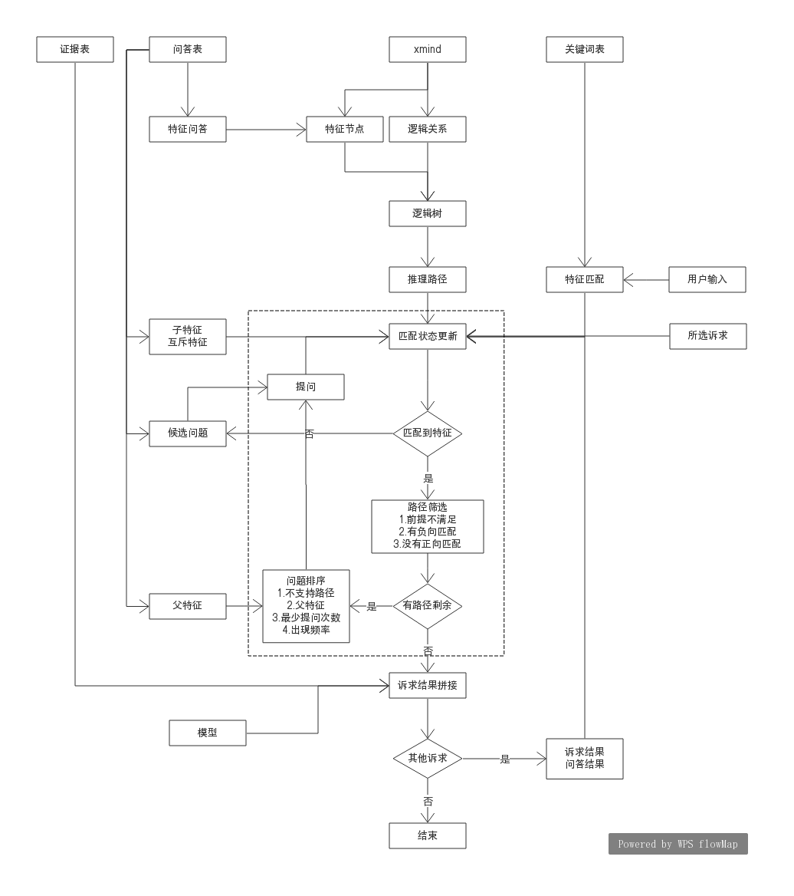

this is reasoning graph

####配置文件
1. *.xmind: 逻辑树
2. *问答.csv: 问答表
3. *关键词.csv: 关键词表
4. *证据.csv: 证据列表

####代码结构
1. factor_match.py: 特征匹配，基于正则进行匹配，对于存在否定词的情形，调用ltp句法分析包进行句法分析，如果否定词修饰的词在正则里才表示否定意义
2. factor_config.py: 读取配置文件信息，从配置文件中加载所有信息到内存，并按照纠纷类型、诉求分类整理
3. logic_tree.py: 构造逻辑树，根据配置信息构造出用于提问和给出评估理由的逻辑树
4. deep_model.py: 支持概率预测模型
5. demo.py: demo测试

####流程图

1. 推理路径: 基于xmind文件自动生成，每条路径代表了一种判决方案(get_all_support_path)。
2. 匹配状态更新: 包括用户输入匹配特征的更新(add_match_result)、所选诉求对应默认特征的更新(add_match_result)、诉求结果对应特征的更新(add_suqiu_result)、问题答案的更新(add_question_result)，更新时需要考虑特征之间的互斥和包含关系
3. 候选问题: 什么都没匹配到的情况下触发，且只触发一次，用于对用户实际情形进行定位(match_flag判断)
4. 路径过滤: 对所有路径进行过滤，排除掉1前提不满足的(_filter_path_by_precondition)、2有特征负向匹配的(get_next_question)、3没有特征正向匹配的路径(get_next_question)
5. 问题排序: 优先级排序。若存在不支持路径，则提问不支持路径对应的问题；若存在连通路径，不提问问题；若特征的父特征正向匹配到，则直接提问该特征对应的问题；对所有特征对应的问题进行统计，计算每个问题最短提问次数、问题对应特征权重，优先提问次数少的，其次提问权重高的(get_next_question)
5. 诉求结果拼接: 对逻辑结果和模型预测结果进行合并，有冲突的按以下逻辑处理：概率支持，逻辑不支持: 提示可能有其他支持情形，引导用户重新评估；概率不支持，逻辑支持: 提示可能是证据问题，引导用户准备证据(print_logic_result)
6. 多诉求: 将其他诉求的支持结果和提问问题的答案加入到新诉求的特征匹配结果中(demo中)
